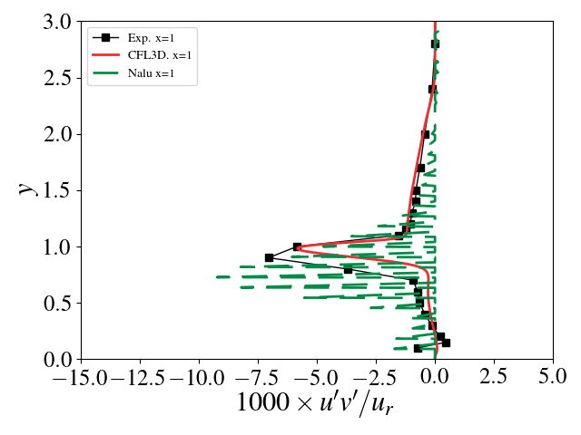
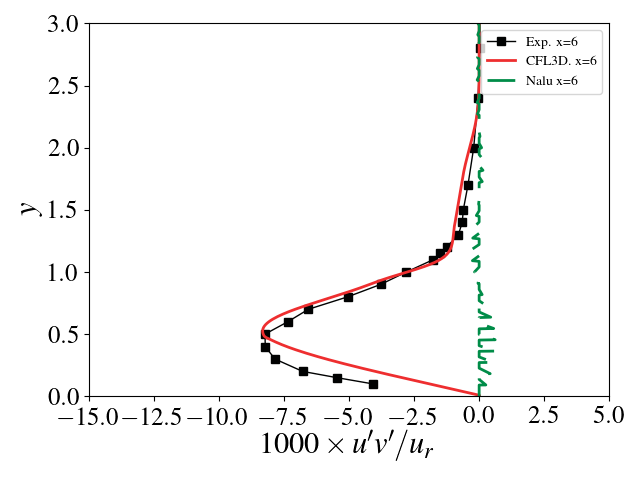

# Backward facing step validation

This presents verification and validation efforts for the SST
implementation in [Nalu](https://github.com/NaluCFD/Nalu) using
NASA's
[2D Backward Facing step](https://turbmodels.larc.nasa.gov/backstep_val.html). The
setup, grids, and NASA code results are all taken from that website.

The initial conditions are chosen to ensure the same flow
conditions. The Mach number (at x=-4, upstream of the step) and
Reynolds number (based on a reference length scale of 1m, the height
of the step) are 0.128 and 36000. The total length of the bottom wall
is 160m. The density of air is 1.177 kg/m^3 and the viscosity is
1.846e-5 kg/ms. The inflow velocity is therefore 0.5646 m/s. No
pressure gradient is imposed between the inlet and outlet (though the
NASA setup does indicate a small pressure drop across the domain). To
ensure as close a setup as the NASA test cases, no wall function is
used to model the SST wall boundary conditions and the inflow BC for
the SST model are set according to
the
[NASA specifications](https://turbmodels.larc.nasa.gov/flatplate_sst.html):
k_farfield = 9e-9/(0.128^2) x (0.5646^2), omega_farfield = 1e-6 x
1.177/1.846e-5 x (0.5646^2)/(0.128^2). Simulations in Nalu were run
until the quantities of interest reached a quasi-steady state
(velocity profiles and surface coefficient).

## Using this repository
A.  Generating the meshes

1. Get CGNS mesh from [the NASA website](https://turbmodels.larc.nasa.gov/backstep_grids.html)
2. Use Pointwise to label the surfaces and set the BC
3. Use Shreyas' [near-distance-to-wall calculator](https://github.com/NaluCFD/NaluWindUtils) to get the NDTW

B. Running

```
mpiexec -np 1 ./naluX -i backStep.i
```

C. Post-processing
```
./pp.py # reads Nalu data, generates tables of quantities of interest
./plot_validation.py
```

## RANS SST

### Validation

There is good agreement between Nalu's SST implementation
and
[NASA's SST implementation](https://turbmodels.larc.nasa.gov/backstep_val_sst.html). Both
implementations (on the finest grid) compare favorably with
the
[experimental data](https://turbmodels.larc.nasa.gov/backstep_val.html). Velocities
in the following plots were non-dimensionalized by the reference
velocity, u_r, which is the velocity at the center of the channel at
x=-4.

#### Velocity profiles at x=-4, 1, 4, 6, 10


<!-- #### Reynolds stress at x=-4, 1, 4, 6, 10 -->
<!--  -->
<!--  -->
<!--  -->
<!--  -->
<!--  -->

#### Skin friction coefficient


#### Pressure coefficient


## Thanks
Thanks to Shreyas Ananthan, Ganesh Vijayakumar, Shashank Yellapantula,
and Matt Barone for their helpful insight and input.
